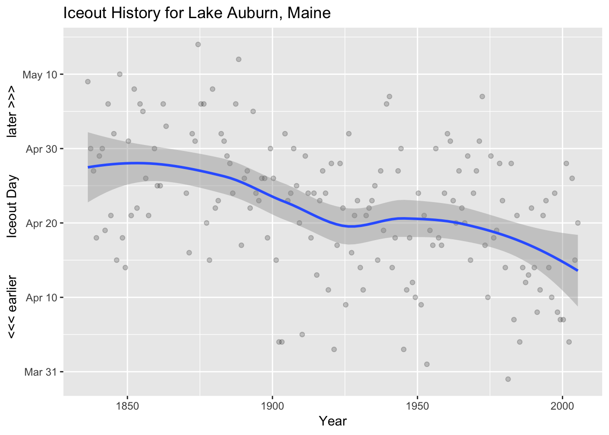

<!-- README.md is generated from README.Rmd. Please edit that file -->


# iceout

Retrieve and Process ‘Ice-out’ Data for New England and Minnesota Inland
Bodies of Water

## Description

Lake ice-out dates, or the dates of ice break-up, are the annual dates
in spring when winter ice cover leaves a lake. Methods are provides to
enable convenient access to New England iceout data from
<https://me.water.usgs.gov/iceout_data> and Minnesota iceout data from
<https://www.dnr.state.mn.us/ice_out/index.html?year=1843> along with
extra Maine state data from
<https://www.maine.gov/dacf/parks/water_activities/boating/ice_out06.shtml>.

## Contents

The following functions are provided:

  - `fetch_all`: Fetch all of the data
  - `iceout`: iceout-package
  - `iceout_path`: Retrieve the data path for the package data
  - `iceout_uri`: Retrieve the URI for online data access
  - `me_iceout`: Maine Bureau of Parks & Lands State Ice-out Data
  - `parse_all`: Parse one or more sites
  - `parse_iceout`: Parse a single iceout file
  - `plot_iceout`: Plot a single iceout dataset
  - `read_iceout`: Read the prepared iceout data
  - `read_maine_iceout_data`: Read Maine Bureau of Parks & Lands State
    Ice-out Data
  - `read_mn_iceout_data`: Read Minnesota Department of Natural
    Resources State Ice-out Data
  - `read_sites`: Read the iceout\_sites file that provides name,
    longname and location data

The following datasets are provided:

  - `me_iceout`: Maine state-level data (2003-present) (use via
    `data(me_iceout)`)
  - `mn_iceout`: Minnesota state-level data (1843-present) (use-via
    `data(mn_iceout)`)
  - `usgs_iceout`: USGS Lake Ice-Out Data for New England (1807-2005)
    (use-via `data(usgs_iceout)`)

## Installation

You can install the development version of `iceout` via:

``` r
devtools::install_github("BigelowLab/iceout")
```

## Usage

``` r
library(iceout)
library(tidyverse)

# current version
packageVersion("iceout")
#> [1] '0.1.0'
```

``` r
# likely being deprecated
io <- read_iceout()
```

``` r
plot_iceout()
```



``` r
data(usgs_iceout)

usgs_iceout
#> # A tibble: 3,372 x 9
#>    state name   long_name   lon   lat  year   doy date       observer      
#>    <chr> <chr>  <chr>     <dbl> <dbl> <dbl> <dbl> <date>     <chr>         
#>  1 Maine Auburn Lake Aub… -70.2  44.1  2005   110 2005-04-20 Auburn Water …
#>  2 Maine Auburn Lake Aub… -70.2  44.1  2004   105 2004-04-14 Auburn Water …
#>  3 Maine Auburn Lake Aub… -70.2  44.1  2003   116 2003-04-26 Auburn Water …
#>  4 Maine Auburn Lake Aub… -70.2  44.1  2002    94 2002-04-04 Auburn Water …
#>  5 Maine Auburn Lake Aub… -70.2  44.1  2001   118 2001-04-28 Auburn Water …
#>  6 Maine Auburn Lake Aub… -70.2  44.1  2000    97 2000-04-06 Auburn Water …
#>  7 Maine Auburn Lake Aub… -70.2  44.1  1999    97 1999-04-07 Auburn Water …
#>  8 Maine Auburn Lake Aub… -70.2  44.1  1998    98 1998-04-08 Auburn Water …
#>  9 Maine Auburn Lake Aub… -70.2  44.1  1997   114 1997-04-24 Auburn Water …
#> 10 Maine Auburn Lake Aub… -70.2  44.1  1996   100 1996-04-09 Auburn Water …
#> # … with 3,362 more rows
```

``` r
data(me_iceout)

me_iceout
#> # A tibble: 1,131 x 3
#>    town         body_name            iceout_date
#>    <chr>        <chr>                <date>     
#>  1 Jackman      Big Wood Pond        2003-05-03 
#>  2 China        China Lake           2003-04-22 
#>  3 Winthrop     Cobbossee Lake       2003-04-22 
#>  4 Gray         Crystal Lake         2003-04-21 
#>  5 Jefferson    Damariscotta Lake    2003-04-16 
#>  6 Eagle Lake   Eagle Lake           2003-05-10 
#>  7 Danforth     East Grand Lake      2003-05-10 
#>  8 Ellsworth    Ellsworth area lakes 2003-04-28 
#>  9 Embden       Embden Pond          2003-04-30 
#> 10 East Machias Gardner Lake         2003-04-27 
#> # … with 1,121 more rows
```

``` r
data(mn_iceout)

mn_iceout
#> # A tibble: 10,261 x 9
#>    source  date       comments  name    lat   lon id    sentinel_lake state
#>    <chr>   <date>     <chr>     <chr> <dbl> <dbl> <chr>         <int> <chr>
#>  1 MNDNR-… 1986-04-16 ""        Pine   46.2 -93.1 0100…             0 Minn…
#>  2 MNDNR-… 1986-04-16 Unknown   Pine   46.2 -93.1 0100…             0 Minn…
#>  3 MNDNR-… 1998-04-04 ""        Pine   46.2 -93.1 0100…             0 Minn…
#>  4 MNPCA   2014-04-28 No ice v… Pine   46.2 -93.1 0100…             0 Minn…
#>  5 MNPCA   2017-04-01 ""        Pine   46.2 -93.1 0100…             0 Minn…
#>  6 MNPCA   2018-05-01 ""        Pine   46.2 -93.1 0100…             0 Minn…
#>  7 MNPCA   1980-04-20 ""        Minn…  46.7 -93.3 0100…             0 Minn…
#>  8 MNPCA   1981-04-06 ""        Minn…  46.7 -93.3 0100…             0 Minn…
#>  9 MNPCA   1982-04-25 ""        Minn…  46.7 -93.3 0100…             0 Minn…
#> 10 MNDNR-… 1983-04-24 ""        Minn…  46.7 -93.3 0100…             0 Minn…
#> # … with 10,251 more rows
```
