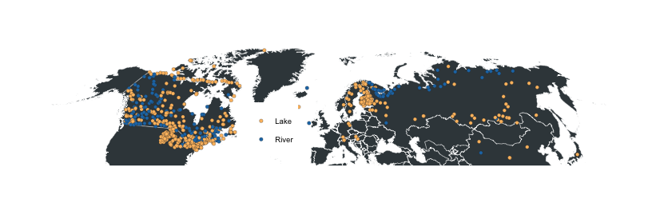

<!-- README.md is generated from README.Rmd. Please edit that file -->

[](https://travis-ci.org/hrbrmstr/iceout)
[](https://codecov.io/github/hrbrmstr/iceout?branch=master)
[](https://cran.r-project.org/package=iceout)


# iceout

Freeze/Thaw Phenology Data of Global Lake and River Ice

## Description

The term phenology in the data set title refers to the seasonal
phenomenon of the freezing and thawing of lake and river ice (also known
as ‘ice-in’/‘ice-out’ and ‘ice-on’/‘ice-off’ data. Ice-out dates, or the
dates of ice break-up, are the annual dates in spring when winter ice
cover leaves an inland body of water. Methods are provides to enable
convenient access to New England iceout data from the
[USGS](https://me.water.usgs.gov/iceout_data) and Minnesota iceout data
from the
[MDNR](https://www.dnr.state.mn.us/ice_out/index.html?year=1843) along
with extra Maine state data from
[MDACF](https://www.maine.gov/dacf/parks/water_activities/boating/ice_out06.shtml)
and a comprehensive global dataset (to 2014) from the
[NSIDC](http://nsidc.org/data/lake_river_ice/).

## Contents

The following functions are provided:

  - `read_maine_iceout_data`: Read Maine Bureau of Parks & Lands State
    Ice-out Data for a Given Year
  - `read_mdnr_metadata`: Retrieves metadata on all available Minnesota
    Lakes.
  - `read_minnesota_iceout_data`: Read Minnesota Department of Natural
    Resources State Ice-out Data
  - `plot_iceout`: Plot a single iceout dataset (excluding data from
    `nsidc_icout`)

The following datasets are provided:

  - `me_iceout`: Maine Bureau of Parks & Lands State Ice-out Data
  - `mn_iceout`: Minnesota Department of Natural Resources State Ice-out
    Data
  - `nsidc_iceout`: NSIDC Global Lake and River Ice Phenology Database,
    Version 1
  - `usgs_iceout`: USGS Lake Ice-Out Data for New England

## Installation

You can install the development version of `iceout` via:

``` r
devtools::install_github("hrbrmstr/iceout") # this fork
# or
devtools::install_github("BigelowLab/iceout") # the original
```

## Usage

``` r
library(iceout)
library(hrbrthemes) # devools install req
library(tidyverse)

# current version
packageVersion("iceout")
## [1] '0.1.0'
```

### NSIDC Data

(NOTE: the convience plotting function doesn’t work with this dataset)

``` r
data(nsidc_iceout)

nsidc_iceout
## # A tibble: 35,918 x 37
##    lakecode lakename lakeorriver season iceon_year iceon_month iceon_day
##    <chr>    <chr>    <chr>       <chr>       <dbl>       <dbl>     <dbl>
##  1 ARAI1    Lake Su… L           1443-…       1443          12         8
##  2 ARAI1    Lake Su… L           1444-…       1444          11        23
##  3 ARAI1    Lake Su… L           1445-…       1445          12         1
##  4 ARAI1    Lake Su… L           1446-…       1446          12         2
##  5 ARAI1    Lake Su… L           1447-…       1447          11        30
##  6 ARAI1    Lake Su… L           1448-…       1448          12         8
##  7 ARAI1    Lake Su… L           1449-…       1449          12        13
##  8 ARAI1    Lake Su… L           1450-…       1450          12         8
##  9 ARAI1    Lake Su… L           1451-…       1451          12        23
## 10 ARAI1    Lake Su… L           1452-…       1452          11        28
## # … with 35,908 more rows, and 30 more variables: iceoff_year <dbl>,
## #   iceoff_month <dbl>, iceoff_day <dbl>, duration <dbl>, latitude <dbl>,
## #   longitude <dbl>, country <chr>, froze <lgl>, obs_comments <chr>,
## #   area_drained <dbl>, bow_comments <chr>, conductivity_us <dbl>,
## #   elevation <dbl>, filename <chr>, initials <chr>, inlet_streams <chr>,
## #   landuse_code <chr>, largest_city_population <dbl>, max_depth <dbl>,
## #   mean_depth <dbl>, median_depth <dbl>, power_plant_discharge <lgl>,
## #   secchi_depth <dbl>, shoreline <dbl>, surface_area <dbl>, state <chr>,
## #   iceon_date <date>, iceon_doy <dbl>, iceout_date <date>,
## #   iceout_doy <dbl>
```

The NSIDC data has quite a bit of global coverage:

``` r
maps::map("world", ".", exact = FALSE, plot = FALSE, fill = TRUE) %>%
  fortify() -> wrld

ggplot() + 
  ggalt::geom_cartogram(
    data = wrld, map = wrld, aes(long, lat, map_id=region), 
    fill="#3B454A",  color = "white", size = 0.125
  ) +
  geom_point(
    data = distinct(nsidc_iceout, lakeorriver, longitude, latitude),
    aes(longitude, latitude, fill = lakeorriver), 
    size = 1.5, color = "#2b2b2b", stroke = 0.125, shape = 21
  ) +
  scale_fill_manual(
    name = NULL, values = c("L"="#fdbf6f", "R"="#1f78b4"), labels=c("L" = "Lake", "R" = "River")
  ) +
  ggalt::coord_proj("+proj=wintri", ylim = range(nsidc_iceout$latitude, na.rm = TRUE)) +
  ggthemes::theme_map() +
  theme(legend.position = c(0.375, 0.1))
```



Let’s look at some US data:

``` r
filter(nsidc_iceout, country == "United States", state == "ME") %>%
  mutate(iceout_date = as.Date(sprintf("2020-%s-%s", iceoff_month, iceoff_day))) %>% # leap year for y axis plotting
  ggplot(aes(iceoff_year, iceout_date)) +
  geom_point(aes(color = lakecode), show.legend = FALSE, size = 0.25, alpha=1/4) +
  geom_smooth(aes(group = lakecode, color = lakecode), se = FALSE, size = 0.25, show.legend = FALSE) +
  labs(
    x = NULL, y = "Ice-out Day", 
    title = "Historical Ice-out Dates for Maine",
    subtitle = "Source: Global Lake and River Ice Phenology Database, Version 1",
    caption = "Source link: https://nsidc.org/data/G01377"
  ) +
  theme_ft_rc(grid="XY")
```


``` r
filter(nsidc_iceout, country == "United States", state == "NY") %>%
  mutate(iceout_date = as.Date(sprintf("2020-%s-%s", iceoff_month, iceoff_day))) %>% # leap year for y axis plotting
  ggplot(aes(iceoff_year, iceout_date)) +
  geom_point(aes(color = lakecode), show.legend = FALSE, size = 0.25, alpha=1/4) +
  geom_smooth(aes(group = lakecode, color = lakecode), se = FALSE, size = 0.25, show.legend = FALSE) +
  labs(
    x = NULL, y = "Ice-out Day", 
    title = "Historical Ice-out Dates for New York",
    subtitle = "Source: Global Lake and River Ice Phenology Database, Version 1",
    caption = "Source link: https://nsidc.org/data/G01377"
  ) +
  theme_ft_rc(grid="XY")
```


### USGS Data

``` r
data(usgs_iceout)

usgs_iceout
## # A tibble: 3,372 x 9
##    state body_name long_name    lon   lat  year   doy date       observer  
##    <chr> <chr>     <chr>      <dbl> <dbl> <dbl> <dbl> <date>     <chr>     
##  1 Maine Auburn    Lake Aubu… -70.2  44.1  2005   110 2005-04-20 Auburn Wa…
##  2 Maine Auburn    Lake Aubu… -70.2  44.1  2004   105 2004-04-14 Auburn Wa…
##  3 Maine Auburn    Lake Aubu… -70.2  44.1  2003   116 2003-04-26 Auburn Wa…
##  4 Maine Auburn    Lake Aubu… -70.2  44.1  2002    94 2002-04-04 Auburn Wa…
##  5 Maine Auburn    Lake Aubu… -70.2  44.1  2001   118 2001-04-28 Auburn Wa…
##  6 Maine Auburn    Lake Aubu… -70.2  44.1  2000    97 2000-04-06 Auburn Wa…
##  7 Maine Auburn    Lake Aubu… -70.2  44.1  1999    97 1999-04-07 Auburn Wa…
##  8 Maine Auburn    Lake Aubu… -70.2  44.1  1998    98 1998-04-08 Auburn Wa…
##  9 Maine Auburn    Lake Aubu… -70.2  44.1  1997   114 1997-04-24 Auburn Wa…
## 10 Maine Auburn    Lake Aubu… -70.2  44.1  1996   100 1996-04-09 Auburn Wa…
## # … with 3,362 more rows
```

### Maine state curated data

``` r
data(me_iceout)

me_iceout
## # A tibble: 1,131 x 6
##    state town         body_name            date        year   doy
##    <chr> <chr>        <chr>                <date>     <int> <int>
##  1 Maine Jackman      Big Wood Pond        2003-05-03  2003   123
##  2 Maine China        China Lake           2003-04-22  2003   112
##  3 Maine Winthrop     Cobbossee Lake       2003-04-22  2003   112
##  4 Maine Gray         Crystal Lake         2003-04-21  2003   111
##  5 Maine Jefferson    Damariscotta Lake    2003-04-16  2003   106
##  6 Maine Eagle Lake   Eagle Lake           2003-05-10  2003   130
##  7 Maine Danforth     East Grand Lake      2003-05-10  2003   130
##  8 Maine Ellsworth    Ellsworth area lakes 2003-04-28  2003   118
##  9 Maine Embden       Embden Pond          2003-04-30  2003   120
## 10 Maine East Machias Gardner Lake         2003-04-27  2003   117
## # … with 1,121 more rows
```

### Minnesota state curated data

``` r
data(mn_iceout)

mn_iceout
## # A tibble: 10,261 x 10
##    state body_name date        year   doy   lat   lon id    comments source
##    <chr> <chr>     <date>     <int> <int> <dbl> <dbl> <chr> <chr>    <chr> 
##  1 Minn… Pine      1986-04-16  1986   106  46.2 -93.1 0100… ""       MNDNR…
##  2 Minn… Pine      1986-04-16  1986   106  46.2 -93.1 0100… Unknown  MNDNR…
##  3 Minn… Pine      1998-04-04  1998    94  46.2 -93.1 0100… ""       MNDNR…
##  4 Minn… Pine      2014-04-28  2014   118  46.2 -93.1 0100… No ice … MNPCA 
##  5 Minn… Pine      2017-04-01  2017    91  46.2 -93.1 0100… ""       MNPCA 
##  6 Minn… Pine      2018-05-01  2018   121  46.2 -93.1 0100… ""       MNPCA 
##  7 Minn… Minnewawa 1980-04-20  1980   111  46.7 -93.3 0100… ""       MNPCA 
##  8 Minn… Minnewawa 1981-04-06  1981    96  46.7 -93.3 0100… ""       MNPCA 
##  9 Minn… Minnewawa 1982-04-25  1982   115  46.7 -93.3 0100… ""       MNPCA 
## 10 Minn… Minnewawa 1983-04-24  1983   114  46.7 -93.3 0100… ""       MNDNR…
## # … with 10,251 more rows
```

### Visualization

USGS

``` r
plot_iceout("usgs", "New Hampshire", "First.Conn")
```


Maine-curated

``` r
plot_iceout("me", "Maine", "Long Pond", town = "Belgrade")
```


Minnesota-curated

``` r
plot_iceout("mn", "Minnesota", "Minnewaska")
```


### Exploring USGS Data

Where are the USGS study lakes?

``` r
library(ggrepel)
library(hrbrthemes) # requires github/hrbrmstr/hrbrthemes ?(for the dark theme)
library(worldtilegrid) # requires github/hrbrmstr/worldtilegrid (for the theme cleaner)

# get ME+NH+MASS map
maps::map("state", ".", exact = FALSE, plot = FALSE, fill = TRUE) %>%
  fortify() %>%
  filter(region %in%  c("maine", "new hampshire", "massachusetts")) %>%
  as_tibble() -> st

ggplot() +
  geom_polygon(
    data = st, aes(long, lat, group=group),
    fill = ft_cols$slate, color = "white", size = 0.125
  ) +
  geom_label_repel(
    data = distinct(usgs_iceout, state, body_name, lon, lat), 
    aes(lon, lat, label=body_name), size=3
  ) +
  coord_quickmap() +
  theme_ft_rc(grid="") +
  worldtilegrid::theme_enhance_wtg()
```


``` r
filter(usgs_iceout, body_name == "Rangeley") %>% 
  pull(lat) %>% 
  unique()  %>% 
  round(2) -> focused_lat

filter(usgs_iceout, lat >= focused_lat) %>% 
  mutate(
    dm = sprintf(
      "2020-%02s-%02s", # use a leap year
      lubridate::month(date),
      lubridate::day(date)
    ),
    dm = as.Date(dm)
  )%>% 
  ggplot(aes(date, dm, group=body_name, color=body_name)) +
  geom_smooth(method = 'loess', size=0.25, se = FALSE) +
  geom_point(size=0.75, alpha=1/3) +
  labs(
    x = NULL, y = "Ice-out Month/Day", color = NULL,
    title = sprintf(
      "Ice-out Trends for lakes at latitude %s and higher", focused_lat
    )
  ) +
  theme_ft_rc(grid="Y")
```


## iceout Metrics

``` r
cloc::cloc_pkg_md()
```

| Lang | \# Files |  (%) | LoC |  (%) | Blank lines |  (%) | \# Lines | (%) |
| :--- | -------: | ---: | --: | ---: | ----------: | ---: | -------: | --: |
| R    |       13 | 0.93 | 384 | 0.78 |         122 | 0.69 |      346 | 0.8 |
| Rmd  |        1 | 0.07 | 110 | 0.22 |          55 | 0.31 |       89 | 0.2 |

## Code of Conduct

Please note that the ‘iceout’ project is released with a [Contributor
Code of Conduct](CODE_OF_CONDUCT.md). By contributing to this project,
you agree to abide by its terms.
