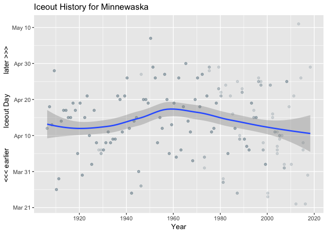

<!-- README.md is generated from README.Rmd. Please edit that file -->


# iceout

Retrieve and Process ‘Ice-out’ Data for New England and Minnesota Inland
Bodies of Water

## Description

Lake ice-out dates, or the dates of ice break-up, are the annual dates
in spring when winter ice cover leaves a lake. Methods are provides to
enable convenient access to New England iceout data from the
[USGS](https://me.water.usgs.gov/iceout_data) and Minnesota iceout data
from the
[MDNR](https://www.dnr.state.mn.us/ice_out/index.html?year=1843) along
with extra Maine state data from
[MDACF](https://www.maine.gov/dacf/parks/water_activities/boating/ice_out06.shtml).

## Contents

The following functions are provided:

  - `fetch_all`: Fetch all of the data
  - `iceout`: iceout-package
  - `iceout_path`: Retrieve the data path for the package data
  - `iceout_uri`: Retrieve the URI for online data access
  - `me_iceout`: Maine Bureau of Parks & Lands State Ice-out Data
  - `parse_all`: Parse one or more sites
  - `parse_iceout`: Parse a single iceout file
  - `plot_iceout`: Plot a single iceout dataset
  - `read_iceout`: Read the prepared iceout data
  - `read_maine_iceout_data`: Read Maine Bureau of Parks & Lands State
    Ice-out Data
  - `read_mn_iceout_data`: Read Minnesota Department of Natural
    Resources State Ice-out Data
  - `read_sites`: Read the iceout\_sites file that provides name,
    longname and location data

The following datasets are provided:

  - `me_iceout`: Maine state-level data (2003-present) (use via
    `data(me_iceout)`)
  - `mn_iceout`: Minnesota state-level data (1843-present) (use-via
    `data(mn_iceout)`)
  - `usgs_iceout`: USGS Lake Ice-Out Data for New England (1807-2005)
    (use-via `data(usgs_iceout)`)

## Installation

You can install the development version of `iceout` via:

``` r
devtools::install_github("BigelowLab/iceout")
```

## Usage

``` r
library(iceout)
library(tidyverse)

# current version
packageVersion("iceout")
#> [1] '0.1.0'
```

### USGS Data

``` r
data(usgs_iceout)

usgs_iceout
#> # A tibble: 3,372 x 9
#>    state body_name long_name    lon   lat  year   doy date       observer  
#>    <chr> <chr>     <chr>      <dbl> <dbl> <dbl> <dbl> <date>     <chr>     
#>  1 Maine Auburn    Lake Aubu… -70.2  44.1  2005   110 2005-04-20 Auburn Wa…
#>  2 Maine Auburn    Lake Aubu… -70.2  44.1  2004   105 2004-04-14 Auburn Wa…
#>  3 Maine Auburn    Lake Aubu… -70.2  44.1  2003   116 2003-04-26 Auburn Wa…
#>  4 Maine Auburn    Lake Aubu… -70.2  44.1  2002    94 2002-04-04 Auburn Wa…
#>  5 Maine Auburn    Lake Aubu… -70.2  44.1  2001   118 2001-04-28 Auburn Wa…
#>  6 Maine Auburn    Lake Aubu… -70.2  44.1  2000    97 2000-04-06 Auburn Wa…
#>  7 Maine Auburn    Lake Aubu… -70.2  44.1  1999    97 1999-04-07 Auburn Wa…
#>  8 Maine Auburn    Lake Aubu… -70.2  44.1  1998    98 1998-04-08 Auburn Wa…
#>  9 Maine Auburn    Lake Aubu… -70.2  44.1  1997   114 1997-04-24 Auburn Wa…
#> 10 Maine Auburn    Lake Aubu… -70.2  44.1  1996   100 1996-04-09 Auburn Wa…
#> # … with 3,362 more rows
```

### Maine state curated data

``` r
data(me_iceout)

me_iceout
#> # A tibble: 1,131 x 6
#>    state town         body_name            date        year   doy
#>    <chr> <chr>        <chr>                <date>     <int> <int>
#>  1 Maine Jackman      Big Wood Pond        2003-05-03  2003   123
#>  2 Maine China        China Lake           2003-04-22  2003   112
#>  3 Maine Winthrop     Cobbossee Lake       2003-04-22  2003   112
#>  4 Maine Gray         Crystal Lake         2003-04-21  2003   111
#>  5 Maine Jefferson    Damariscotta Lake    2003-04-16  2003   106
#>  6 Maine Eagle Lake   Eagle Lake           2003-05-10  2003   130
#>  7 Maine Danforth     East Grand Lake      2003-05-10  2003   130
#>  8 Maine Ellsworth    Ellsworth area lakes 2003-04-28  2003   118
#>  9 Maine Embden       Embden Pond          2003-04-30  2003   120
#> 10 Maine East Machias Gardner Lake         2003-04-27  2003   117
#> # … with 1,121 more rows
```

### Minnesota state curated data

``` r
data(mn_iceout)

mn_iceout
#> # A tibble: 10,261 x 10
#>    state body_name date        year   doy   lat   lon id    comments source
#>    <chr> <chr>     <date>     <int> <int> <dbl> <dbl> <chr> <chr>    <chr> 
#>  1 Minn… Pine      1986-04-16  1986   106  46.2 -93.1 0100… ""       MNDNR…
#>  2 Minn… Pine      1986-04-16  1986   106  46.2 -93.1 0100… Unknown  MNDNR…
#>  3 Minn… Pine      1998-04-04  1998    94  46.2 -93.1 0100… ""       MNDNR…
#>  4 Minn… Pine      2014-04-28  2014   118  46.2 -93.1 0100… No ice … MNPCA 
#>  5 Minn… Pine      2017-04-01  2017    91  46.2 -93.1 0100… ""       MNPCA 
#>  6 Minn… Pine      2018-05-01  2018   121  46.2 -93.1 0100… ""       MNPCA 
#>  7 Minn… Minnewawa 1980-04-20  1980   111  46.7 -93.3 0100… ""       MNPCA 
#>  8 Minn… Minnewawa 1981-04-06  1981    96  46.7 -93.3 0100… ""       MNPCA 
#>  9 Minn… Minnewawa 1982-04-25  1982   115  46.7 -93.3 0100… ""       MNPCA 
#> 10 Minn… Minnewawa 1983-04-24  1983   114  46.7 -93.3 0100… ""       MNDNR…
#> # … with 10,251 more rows
```

### Visualization

USGS

``` r
plot_iceout("usgs", "New Hampshire", "First.Conn")
```


Maine-curated

``` r
plot_iceout("me", "Maine", "Long Pond", town = "Belgrade")
```


Minnesota-curated

``` r
plot_iceout("mn", "Minnesota", "Minnewaska")
```


